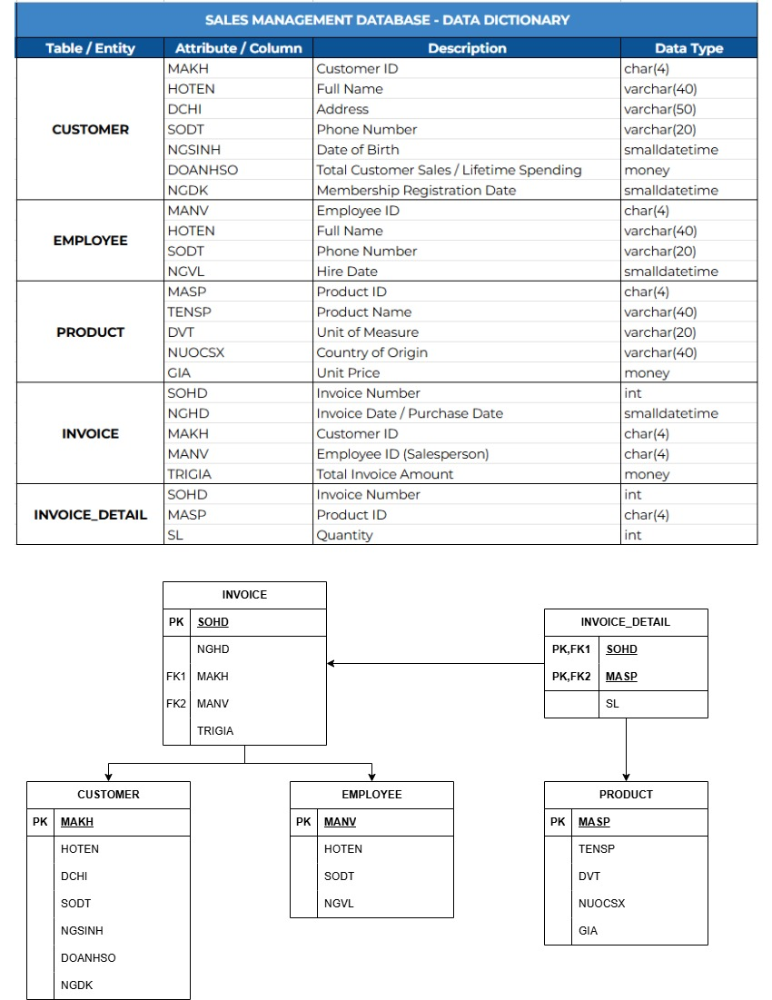

# 🛒 Sales Management Database & SQL Analytics

This repository contains the complete SQL scripts for designing, populating, and querying a **Sales Management Database System**, developed as part of a Database Systems course.

---

## 📌 Project Architecture & ERD

The database follows a normalized relational structure (3NF) containing 5 key entities:
* **CUSTOMER** - Customer information and sales volume tracking
* **EMPLOYEE** - Staff records and hire dates
* **PRODUCT** - Product catalog, unit pricing, and origin
* **INVOICE** - Sales transaction headers
* **INVOICE_DETAIL** - Line-item transaction breakdown



---

## 🛠 Tech Stack & Skills
* **Language:** SQL (Data Definition Language & Data Manipulation Language)
* **Concepts:** 3NF Normalization, Referential Integrity, Multi-table JOINs, Subqueries, Aggregations (`GROUP BY`, `HAVING`), Window Functions.

---

## 💡 Key Business Questions Solved via SQL

1. **Revenue Analytics:** Calculating daily/monthly revenue trends and average order values.
2. **Customer Insights:** Ranking top customers by cumulative purchase volume and classifying loyalty tiers (VIP vs. Regular).
3. **Product Performance:** Identifying top-selling products, zero-sales items, and price-tier distribution.
4. **Staff Performance:** Evaluating sales generated per employee over specific time periods.

---

## 📁 Repository Structure

```text
.
├── assets/
│   └── 01_database_erd_diagram.png
├── scripts/
│   ├── 01_schema_definition.sql
│   ├── 02_data_insertion.sql
│   └── 03_analytics_queries.sql
└── README.md
