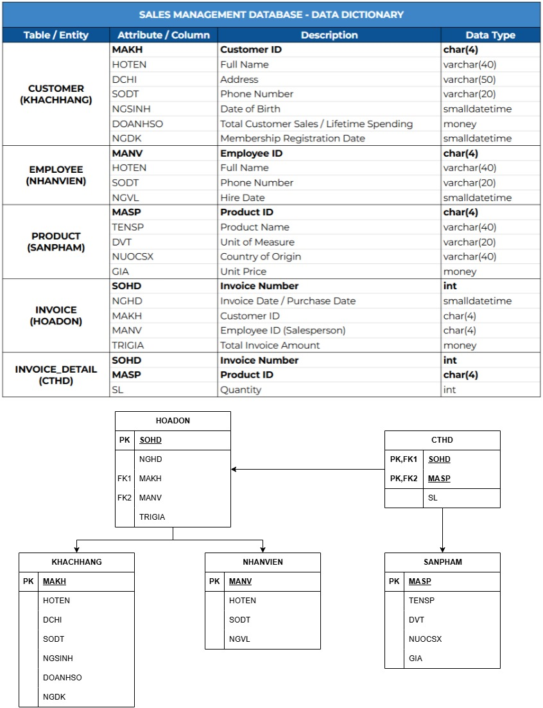
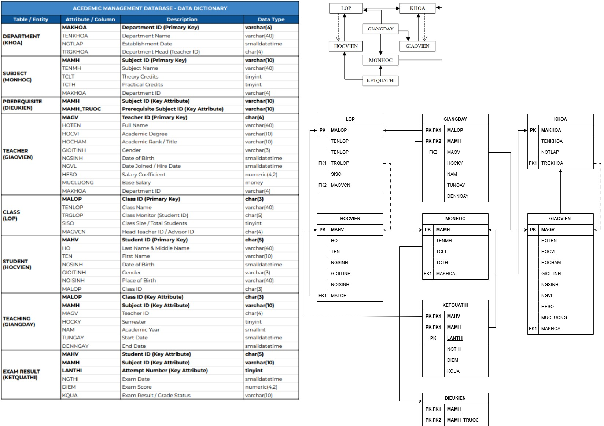

# 📊 Relational Database Systems & SQL Analytics (Sales & Academic Management)

This repository contains the complete SQL scripts for designing, implementing, and querying two comprehensive relational database systems developed as part of a Database Systems course:
1. **Sales Management System** (Retail & Customer Analytics)[cite: 1]
2. **Academic Management System** (Student Performance & Educational Administration)[cite: 7]

---

## 📌 Project Architecture & ERD Diagrams

Both databases follow a fully normalized relational structure (3NF) to enforce referential integrity and optimize query performance:

### 1. Sales Management Database
* **CUSTOMER** - Customer profiles and spending volume tracking[cite: 2, 4]
* **EMPLOYEE** - Staff directory and employment records[cite: 2, 4]
* **PRODUCT** - Product catalog, unit pricing, and origin details[cite: 2, 4]
* **INVOICE** - Sales transaction headers[cite: 2, 4]
* **INVOICE_DETAIL** - Line-item transaction breakdown[cite: 2, 4]
* 

### 2. Academic Management Database
* **HOCVIEN (Student)** - Student profiles, demographic data, and class enrollment[cite: 7, 11]
* **LOP (Class)** - Class details, student capacity, and homeroom teachers[cite: 7, 11]
* **KHOA (Faculty)** - Faculty departments and department heads[cite: 7, 11]
* **GIAOVIEN (Teacher)** - Faculty staff records, academic titles, and salary coefficients[cite: 7, 11]
* **MONHOC (Course)** - Course curriculum, theory/practical credits, and managing faculty[cite: 7, 11]
* **DIEUKIEN (Prerequisite)** - Course dependency rules[cite: 7, 11]
* **GIANGDAY (Teaching Assignment)** - Course scheduling per class, semester, and year[cite: 7, 11]
* **KETQUATHI (Exam Result)** - Exam scores, attempt tracking, and pass/fail statuses[cite: 7, 11]


---

## 🛠 Tech Stack & Core Concepts
* **Language:** SQL (Data Definition Language & Data Manipulation Language)[cite: 4, 5, 11, 12]
* **Database Engine:** MS SQL Server / MySQL
* **Core Concepts:** 3NF Normalization, Complex Constraints & Triggers, Multi-table `JOIN`s, Correlated Subqueries, Aggregations (`GROUP BY`, `HAVING`), Window Functions (`RANK`, `DENSE_RANK`), Set Operations.

---

## 💡 Key Business & Academic Analytics Solved

### 🛒 Sales Domain:
1. **Revenue Analytics:** Calculating daily/monthly revenue trends and average order values[cite: 6].
2. **Customer Segmentation:** Ranking top customers by lifetime spending and classifying loyalty tiers (VIP vs. Regular)[cite: 5, 6].
3. **Inventory & Product Metrics:** Identifying top-selling items vs. zero-sales inventory[cite: 6].
4. **Staff Performance:** Evaluating sales revenue generated per employee[cite: 5, 6].

### 🎓 Academic Domain:
1. **Student Academic Performance:** Computing overall GPA, tracking exam attempts, and auto-assigning academic standing (Honor Roll, Pass, Probation)[cite: 12, 13].
2. **Course & Prerequisite Tracking:** Verifying student eligibility based on course prerequisites[cite: 12].
3. **Faculty Workload Analysis:** Tracking teaching load per instructor across semesters and academic years[cite: 14].
4. **Failure Rate Analytics:** Identifying high-difficulty courses based on first-attempt failure rates[cite: 14].

---

## 📁 Repository Structure

```text
.
├── assets/
│   └── 01_database_erd_diagram.png
├── scripts/
│   ├── sales_db/
│   │   ├── 01_sales_schema.sql
│   │   ├── 02_sales_data.sql
│   │   └── 03_sales_queries.sql
│   └── academic_db/
│       ├── 01_academic_schema.sql
│       ├── 02_academic_data.sql
│       └── 03_academic_queries.sql
└── README.md


